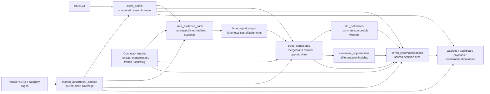

# Research Agent Architecture

This diagram shows the system in agent/harness terms rather than as a rigid pipeline.

- The **Research Agent** is the central reasoner pursuing the user's goal.
- The **Agentic Harness** steers the agent with prompts, skills, and validators.
- **Tools / Connectors** provide external evidence.
- **Working Artifacts** are structured objects the agent can create, refine, and revisit.

## Agent Architecture

```mermaid
flowchart TB
    U["PM goal / brief / URLs"] --> A["Research Agent"]

    subgraph H["Agentic Harness"]
        P["System prompt / task framing"]
        S["Skills library
        00a market assortment intake
        00 client profiling
        01 extraction guidance
        02 lane trend interpretation
        03 synthesis guidance
        04 SKU concretization
        05 sentiment opportunity analysis
        06 tiering guidance
        07 output assembly"]
        V["Programmatic validators
        required fields
        schema checks
        contradiction checks
        minimum evidence rules"]
    end

    P --> A
    S --> A
    V --> A

    subgraph T["Tools / Connectors"]
        T1["Retailer page fetch / scraper"]
        T2["Apify social connectors"]
        T3["Oxylab marketplace scraping"]
        T4["SerpAPI"]
        T5["TMAPI"]
    end

    A <--> T1
    A <--> T2
    A <--> T3
    A <--> T4
    A <--> T5

    subgraph W["Working Artifacts"]
        W1["market_assortment_context
        retailer coverage, gaps, whitespace hypotheses"]
        W2["client_profile
        structured client frame, constraints, routing hints"]
        W3["lane_evidence_pack
        normalized raw evidence for one lane"]
        W4["lane_signal_output
        lane-local trend interpretations"]
        W5["trend_candidates
        cross-lane ranked opportunity set"]
        W6["sku_definitions
        sourceable product formats and variants"]
        W7["sentiment_opportunities
        complaints, likes, wishlist-driven improvements"]
        W8["tiered_recommendations
        auditable 1 / 2 / 3 / Skip decisions"]
    end

    A <--> W1
    A <--> W2
    A <--> W3
    A <--> W4
    A <--> W5
    A <--> W6
    A <--> W7
    A <--> W8

    A --> O["Final outputs
    catalogs / dashboard payloads / recommendation notes"]
```

## Artifact Graph

This second diagram shows common artifact relationships without implying mandatory sequencing.

## Artifact Glossary

- `market_assortment_context`: structured view of what target retailers already carry, where assortment is broad or shallow, and which whitespace hypotheses seem credible.
- `client_profile`: normalized client frame including platform, markets, categories, buyer logic, commercial constraints, and capability hints for the harness.
- `lane_evidence_pack`: normalized evidence collected for a single lane such as TikTok, Amazon, or Xiaohongshu. This is still evidence, not a trend verdict.
- `lane_signal_output`: that lane's interpretation of the evidence, including signal strength, trend status, and fit notes, without cross-lane merging.
- `trend_candidates`: merged cross-lane opportunity set after synthesis, time-machine logic, and assortment-fit adjustment.
- `sku_definitions`: concrete sourceable product formats or variants that make a trend actionable for sourcing or private label work.
- `sentiment_opportunities`: structured complaints, likes, and wishlists that help shape differentiation where product design is still in play.
- `tiered_recommendations`: auditable priority decisions such as Tier 1, Tier 2, Tier 3, or Skip based on trend, saturation, margin, and fit.

## Notes

- A common run may still resemble a sequence, but the harness is free to skip, revisit, or refine artifacts.
- `00a_market_assortment_intake` is optional and only used when retailer/category inputs materially improve the market view.
- `04_sku_mapping` and `05_sentiment_analysis` are conditional capabilities, not mandatory stages.
