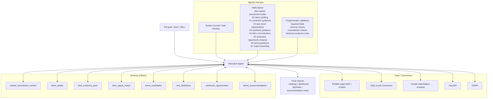
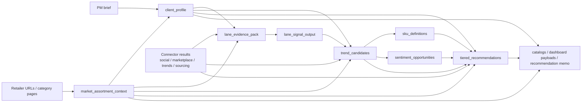

# Research Agent Architecture

This diagram shows the system in agent/harness terms rather than as a rigid pipeline.

- The **Research Agent** is the central reasoner pursuing the user's goal.
- The **Agentic Harness** steers the agent with prompts, skills, and validators.
- **Tools / Connectors** provide external evidence.
- **Working Artifacts** are structured objects the agent can create, refine, and revisit.

## Agent Architecture

## Artifact Graph

This second diagram shows common artifact relationships without implying mandatory sequencing.

## Notes

- A common run may still resemble a sequence, but the harness is free to skip, revisit, or refine artifacts.
- `00a_market_assortment_intake` is optional and only used when retailer/category inputs materially improve the market view.
- `04_sku_mapping` and `05_sentiment_analysis` are conditional capabilities, not mandatory stages.
